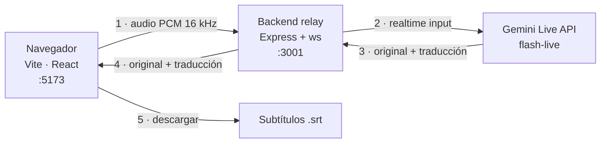
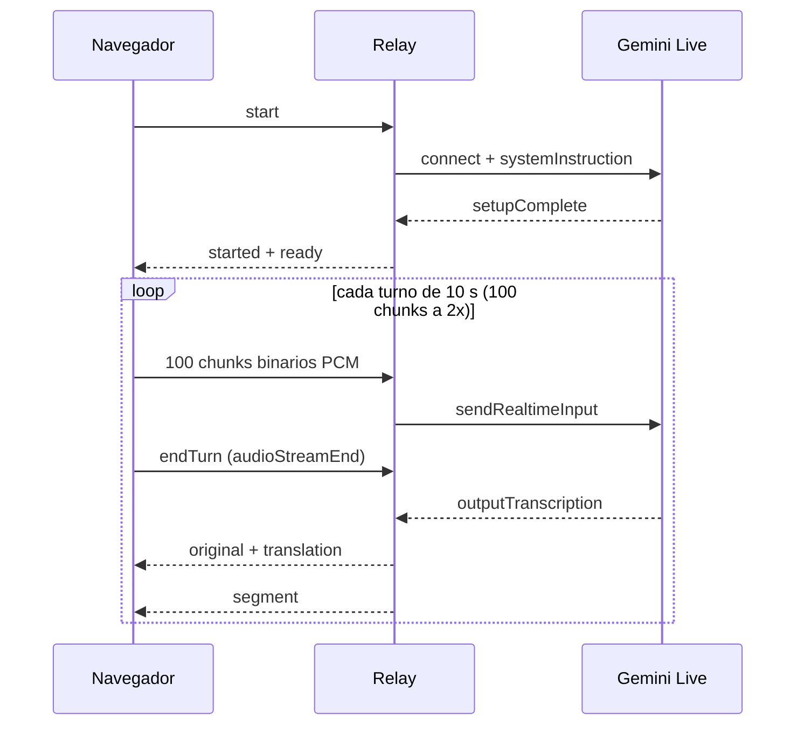

# BRIDGE

[](https://nodejs.org)
[](https://pnpm.io)
[](https://react.dev)
[](https://vite.dev)
[](https://www.typescriptlang.org)
[](#licencia)

Transcripción y traducción en tiempo real **(EN → ES)** de conferencias usando la **Gemini Live API** (modelo de audio, WebSocket bidireccional). El navegador captura el audio, el backend lo reenvía a una sesión `live` de Gemini y devuelve la transcripción original y la traducción al español, que la UI renderiza en un panel estilo "subtítulos".

---

## Índice

- [Arquitectura](#arquitectura)
- [Cómo correr](#cómo-correr)
- [Audios de prueba](#audios-de-prueba)
- [Demo del jurado](#demo-del-jurado-protocolo)
- [Rendimiento medido](#rendimiento-medido-run-real-clip-de-40-s)
- [Decisiones de diseño](#decisiones-de-diseño)
- [Configuración](#configuración-backendenv)
- [Estructura del repo](#repo)
- [Licencia](#licencia)

---

## Arquitectura



El backend es un **relay**: no transcribe ni traduce, solo reenvía audio a Gemini y devuelve el texto. Por eso la `GEMINI_API_KEY` nunca llega al navegador.

### Flujo de un archivo (turn-splitting)



> [!IMPORTANT]
> El `segment` es la unidad de sincronización: el navegador **espera** a recibirlo antes de enviar el turno siguiente. Saltarse esa espera ("overlap") es inestable con modality `audio`.

---

## Cómo correr

**Requisitos**: Node ≥ 20 y pnpm 10.15.1 (probado en Node 22.19.0).

```bash
pnpm install
cp backend/.env.example backend/.env    # luego pegá tu GEMINI_API_KEY
pnpm dev                                # backend :3001 + frontend :5173
```

- **Backend**: `backend/.env` con `GEMINI_API_KEY=...` (ver [Configuración](#configuración-backendenv)).
- **Frontend**: `http://localhost:5173`.

> [!TIP]
> Para debuggear: `BRIDGE_DEBUG=1 pnpm dev` en la terminal del backend (logs `[tscriber-verbose]` / `[ws-relay]`) y `http://localhost:5173/?debug=1` en el navegador.

---

## Audios de prueba

Todos los clips de prueba viven en **`backend/assets/`**:

| Archivo | Duración | Formato | Peso | Para qué sirve |
|---|---|---|---|---|
| `short-demo.wav` | 40,0 s | 16 kHz · mono · 16-bit | 1,22 MB | **Demo del jurado**: clip balanceado, da ~4 segmentos completos |
| `short-talk.wav` | 10,0 s | 16 kHz · mono · 16-bit | 0,31 MB | Iteración rápida al debuggear (un solo turno) |
| `talk.wav` | 355,0 s (5:55) | 16 kHz · mono · 16-bit | 10,83 MB | Charla completa; es el audio original del que salen los clips |
| `sample.pcm` | ~3,0 s | PCM crudo 16 kHz · mono · 16-bit | 96,9 KB | **Default de los tests de consola** (`test:connection` y `test:pipeline`) |
| `talk.webm` | — | WebM | 5,67 MB | Grabación original; ningún script la usa (sirve para probarla en la UI) |

### Probar un clip en la UI

Usá **"Subir archivo"** y elegí el clip. Para una prueba rápida, `short-talk.wav`; para el demo del jurado, `short-demo.wav`.

### Probar un clip en los tests de consola

Los tests aceptan un path como argumento. Si no lo pasás, usan `assets/sample.pcm`:

```bash
pnpm test:connection                                # usa backend/assets/sample.pcm
pnpm test:connection backend/assets/short-talk.wav  # clip de 10 s
pnpm test:pipeline backend/assets/short-demo.wav    # clip de 40 s
```

> [!NOTE]
> Los scripts de consola (`backend/src/audio/load-pcm.ts`) aceptan **solo `.pcm` y `.wav`**. El navegador acepta mucho más (`.mp3`, `.m4a`, `.ogg`, `.webm` y video `.mp4`, `.m4v`, `.mov`).

### Scripts disponibles

| Comando | Qué hace |
|---|---|
| `pnpm dev` | Backend (`tsx watch`) + frontend (`vite`) en paralelo |
| `pnpm build` | Compila backend (`tsc`) y frontend (`vite build`) |
| `pnpm --filter @bridge/frontend lint` | Lint del frontend (`oxlint`) |
| `pnpm test:connection [archivo]` | Smoke test contra la Gemini Live API |
| `pnpm --filter @bridge/backend test:pipeline [archivo]` | Prueba del pipeline de audio |
| `pnpm --filter @bridge/frontend preview` | Sirve el build de producción |

---

## Demo del jurado (protocolo)

1. Levantar el backend con logs de diagnóstico: `BRIDGE_DEBUG=1 pnpm dev`.
2. Abrir `http://localhost:5173/?debug=1`.
3. Subir `backend/assets/short-demo.wav` (**40 s**, 16 kHz / mono / 16-bit).
4. Esperar y narrar: primer texto ~6-8 s, un segmento completo cada ~18 s, 4 segmentos en ~70 s de reloj.

Lo que el jurado ve en pantalla: el panel muestra primero la transcripción original en inglés que baja mientras el audio se "transmite", y debajo la traducción en español que se completa por segmentos.

---

## Rendimiento medido (run real, clip de 40 s)

| Eslabón | Momento |
|---|---|
| Conexión WS + `start` | 0.0 s |
| Gemini listo (`status/ready`, T3) | 1.4 s |
| Primer chunk de audio (T1) | 1.9 s |
| Subida turno 1 completa (100 chunks @ 2×) | 6.9 s |
| Primer `original` (EN) en panel | 9.5 s (T5−T1 = 7.6 s) |
| Primera `translation` (ES) en panel | 10.0 s (T5−T1 = 8.1 s) |
| Segmento 1 | 16.9 s (latencia de turno 10.0 s) |
| Segmento 2 | 35.1 s (13.2 s) |
| Segmento 3 | 51.8 s (11.7 s) |
| Segmento 4 (final) | 69.9 s (13.2 s) |

Rangos observados en varios runs (`short-demo.wav` 40 s y `short-talk.wav` 10 s):

- **Primer texto en pantalla**: 5.4–8.1 s después del primer chunk (varía por sesión).
- **Cadencia de segmentos**: ~16–22 s (un turno de 10 s de audio).
- **Latencia de finalización de turno**: ~11–13 s (el modelo "habla" la traducción; `turnComplete` llega al terminar).
- **Wall-clock vs duración del audio**: ~1.75–1.9× (40 s → ~70 s; 60 s → ~114 s).

> [!WARNING]
> **Límite honesto**: la latencia por turno está dominada por la finalización de turno de Gemini con modality `audio`, no por la subida de audio. Bien para 1 sesión de demo en vivo; tiempo real sostenido (o 2+ sesiones compitiendo por el mismo rate-limit) queda al límite.

---

## Decisiones de diseño

- **Modality `audio` obligatorio**: el modelo rechaza la modalidad `TEXT` (`1007 The requested combination of response modalities (TEXT) is not supported`). La traducción se recibe como `outputTranscription` de la respuesta hablada; `turnComplete` llega solo cuando el modelo termina de hablar.
- **Sin interims**: la API **no emite** `interimInputTranscription` durante el streaming — el texto (original y traducción) solo baja tras `audioStreamEnd` de cada turno. Por eso el diseño es **turn-splitting** (ver el diagrama de secuencia): se envían turnos de 10 s de audio a **2×** (100 chunks de 100 ms, 50 ms/chunk), se hace `endTurn` y se espera el `segment` antes de seguir (`TURN_CHUNKS = 100`, `TURN_WAIT_MS = 20000`).
- **`accumulatedOutput` se resetea en cada `turnComplete`**: cada segmento es autocontenido; sin esto el texto del turno anterior contamina la traducción siguiente (`backend/src/gemini/transcriber.ts`).
- **Reconexión resiliente**: el backend reintenta el bind del puerto con backoff si el proceso anterior todavía lo ocupa (típico de `tsx watch`), y libera el puerto en `SIGINT`/`SIGTERM`. El frontend, si el ack de arranque se vence, descarta el socket y reintenta una vez.

---

## Configuración (backend/.env)

| Variable | Default | Descripción |
|---|---|---|
| `GEMINI_API_KEY` | — | Clave de [Google AI Studio](https://aistudio.google.com/apikey) |
| `GEMINI_LIVE_MODEL` | `gemini-3.1-flash-live-preview` | Modelo Live |
| `GEMINI_LIVE_VOICE` | `Aoede` | Voz de la respuesta |
| `PORT` | `3001` | Puerto del backend |
| `BRIDGE_RESPONSE_MODALITY` | `audio` | `audio` o `text` (solo `audio` funciona) |
| `BRIDGE_SOURCE_LANG` | `en` | Idioma fuente |
| `BRIDGE_TARGET_LANG` | `es` | Idioma de traducción |
| `BRIDGE_RECONNECT_MAX_ATTEMPTS` | `3` | Reintentos de reconexión con Gemini |
| `BRIDGE_RECONNECT_BASE_DELAY_MS` | `1000` | Delay base del backoff exponencial |
| `BRIDGE_READY_TIMEOUT_MS` | `15000` | Timeout esperando `setupComplete` |
| `BRIDGE_STALE_SESSION_MS` | `60000` | Watchdog de sesión colgada (`0` desactiva) |

---

## Repo

```text
backend/
  src/gemini/transcriber.ts   # sesión Live de Gemini, merge + reset de traducción
  src/ws/handler.ts           # relay WS (navegador ↔ backend) con log [ws-relay]
  src/config.ts               # env → BridgeConfig
  src/errors.ts               # errores crudos → mensajes en español para la UI
  src/audio/load-pcm.ts       # carga .pcm/.wav → PCM 16 kHz mono
  assets/                     # clips de prueba (ver "Audios de prueba")
  test-connection.ts          # smoke test contra la Gemini Live API
  test-pipeline.ts            # prueba del pipeline de audio
frontend/
  src/hooks/useBridgeSession.js     # playFile: pacing 2× + turn-splitting + retry
  src/lib/ws/bridge-socket.js       # protocolo WS (chunks binarios, endTurn, segment)
  src/lib/audio/decode-file.js      # decodifica el archivo del navegador a PCM 16 kHz
  src/lib/subtitles.js              # buildSrt + descarga del .srt
  src/lib/errors.js                 # errores → mensajes en español
  src/lib/debug.js                  # logs gated por ?debug=1
```

---

## Licencia

[MIT](./LICENSE) © 2026 Bridge (Nerdearla Vibeathon 2026)
